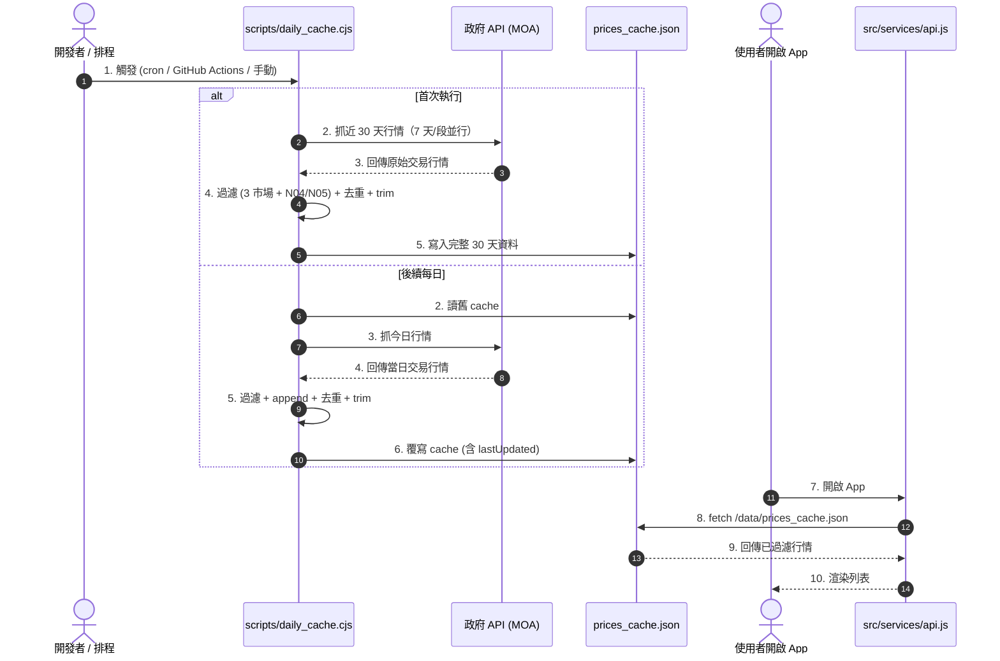

# 農業部資料開放平臺 API 資料結構與規格

本文件整理並記錄本專案所介接的兩大農業部開放資料 (OpenData) 來源之資料結構，做為前端及資料處理腳本的參考規格。

---

## 1. 農產品交易行情 API (FarmTransData)

- **資料集名稱**：農產品批發市場交易行情
- **API 端點 (Endpoint)**：
  `https://data.moa.gov.tw/Service/OpenData/FromM/FarmTransData.aspx`
- **主要參數**：
  - `StartDate`: 交易起始日期 (格式：`YYY.MM.DD`，民國年)
  - `EndDate`: 交易結束日期 (格式：`YYY.MM.DD`，民國年)
  - `$top`: 限制回傳筆數
  - `$skip`: 跳過筆數

### 資料結構範例 (5 筆資料)

```json
[
  {
    "交易日期": "115.06.22",
    "種類代碼": "N04",
    "作物代號": "FV6",
    "作物名稱": "辣椒-糯米椒",
    "市場代號": "950",
    "市場名稱": "花蓮市",
    "上價": 70.5,
    "中價": 55.2,
    "下價": 27.2,
    "平均價": 52.7,
    "交易量": 208
  },
  {
    "交易日期": "115.06.22",
    "種類代碼": "N04",
    "作物代號": "FY4",
    "作物名稱": "玉米-玉米筍",
    "市場代號": "950",
    "市場名稱": "花蓮市",
    "上價": 36,
    "中價": 26,
    "下價": 8,
    "平均價": 24.4,
    "交易量": 128.5
  },
  {
    "交易日期": "115.06.22",
    "種類代碼": "N04",
    "作物代號": "LA7",
    "作物名稱": "甘藍-改良尖",
    "市場代號": "950",
    "市場名稱": "花蓮市",
    "上價": 44.6,
    "中價": 39,
    "下價": 26.2,
    "平均價": 37.6,
    "交易量": 7703
  },
  {
    "交易日期": "115.06.22",
    "種類代碼": "N04",
    "作物代號": "SA1",
    "作物名稱": "蘿蔔-梅花",
    "市場代號": "950",
    "市場名稱": "花蓮市",
    "上價": 10,
    "中價": 10,
    "下價": 7.8,
    "平均價": 9.5,
    "交易量": 904
  },
  {
    "交易日期": "115.06.22",
    "種類代碼": "N04",
    "作物代號": "SP1",
    "作物名稱": "薑-老薑",
    "市場代號": "950",
    "市場名稱": "花蓮市",
    "上價": 140,
    "中價": 140,
    "下價": 140,
    "平均價": 140,
    "交易量": 51
  }
]
```

### 欄位說明

| 欄位名稱 | 資料型態 | 範例值 | 說明 |
| :--- | :--- | :--- | :--- |
| **交易日期** | String | `"115.06.22"` | 交易日期，使用民國曆點分隔格式 |
| **種類代碼** | String | `"N04"` | 作物大類代碼 (如 N04 代表蔬菜、N05 代表水果、N06 代表花卉) |
| **作物代號** | String | `"LA7"` | 交易市場自訂的作物代碼 |
| **作物名稱** | String | `"甘藍-改良尖"` | 作物名稱，通常為主名稱與品種以破折號連接 (如 `作物-品種`) |
| **市場代號** | String | `"950"` | 批發市場代碼 |
| **市場名稱** | String | `"花蓮市"` | 批發市場中文名稱 |
| **上價** | Number | `44.6` | 批發市場該日最高交易價格 (元/公斤) |
| **中價** | Number | `39` | 批發市場該日中間交易價格 (元/公斤) |
| **下價** | Number | `26.2` | 批發市場該日最低交易價格 (元/公斤) |
| **平均價** | Number | `37.6` | 批發市場該日平均交易價格 (元/公斤) |
| **交易量** | Number | `7703` | 該日總交易數量 (公斤) |

---

## 2. 農作物統一名稱與代碼 API (LC7YWlenhLuP)

- **資料集名稱**：農作物統一名稱與代碼
- **API 端點 (Endpoint)**：
  `https://data.moa.gov.tw/Service/OpenData/TransService.aspx?UnitId=LC7YWlenhLuP`
- **主要參數**：
  - `UnitId`: 介接代號 `LC7YWlenhLuP`
  - `$top`: 限制回傳筆數 (如 `$top=5`，但需注意 TransService 有時不支持分頁參數，可能需全量抓取)

### 資料結構範例 (5 筆資料，包含 6 級完整分類欄位)

```json
[
  {
    "CROP_UID": "00208075001999950",
    "CNAME": "甜椒-其它品種進口",
    "ALIAS_CNAME": "",
    "PLV1": "002",
    "PLV1_NAME": "蔬菜類",
    "PLV2": "08",
    "PLV2_NAME": "果菜類",
    "PLV5": "075",
    "PLV5_NAME": "茄科",
    "PLV3": "001",
    "PLV3_NAME": "甜椒",
    "PLV4": "9999",
    "PLV4_NAME": "其它品種",
    "PLV6": "50"
  },
  {
    "CROP_UID": "00208075001000450",
    "CNAME": "甜椒-水果彩椒進口",
    "ALIAS_CNAME": "",
    "PLV1": "002",
    "PLV1_NAME": "蔬菜類",
    "PLV2": "08",
    "PLV2_NAME": "果菜類",
    "PLV5": "075",
    "PLV5_NAME": "茄科",
    "PLV3": "001",
    "PLV3_NAME": "甜椒",
    "PLV4": "0004",
    "PLV4_NAME": "水果彩椒",
    "PLV6": "50"
  },
  {
    "CROP_UID": "00208075001000350",
    "CNAME": "甜椒-青椒進口",
    "ALIAS_CNAME": "",
    "PLV1": "002",
    "PLV1_NAME": "蔬菜類",
    "PLV2": "08",
    "PLV2_NAME": "果菜類",
    "PLV5": "075",
    "PLV5_NAME": "茄科",
    "PLV3": "001",
    "PLV3_NAME": "甜椒",
    "PLV4": "0003",
    "PLV4_NAME": "青椒",
    "PLV6": "50"
  },
  {
    "CROP_UID": "00208075001000250",
    "CNAME": "甜椒-彩色種甜椒進口",
    "ALIAS_CNAME": "",
    "PLV1": "002",
    "PLV1_NAME": "蔬菜類",
    "PLV2": "08",
    "PLV2_NAME": "果菜類",
    "PLV5": "075",
    "PLV5_NAME": "茄科",
    "PLV3": "001",
    "PLV3_NAME": "甜椒",
    "PLV4": "0002",
    "PLV4_NAME": "彩色種甜椒",
    "PLV6": "50"
  },
  {
    "CROP_UID": "00201118020000550",
    "CNAME": "萵苣-廣東菜進口",
    "ALIAS_CNAME": "",
    "PLV1": "002",
    "PLV1_NAME": "蔬菜類",
    "PLV2": "01",
    "PLV2_NAME": "葉菜類",
    "PLV5": "118",
    "PLV5_NAME": "菊科",
    "PLV3": "020",
    "PLV3_NAME": "萵苣",
    "PLV4": "0005",
    "PLV4_NAME": "廣東菜",
    "PLV6": "50"
  }
]
```

### 欄位說明

| 欄位名稱 | 資料型態 | 範例值 | 說明 |
| :--- | :--- | :--- | :--- |
| **CROP_UID** | String | `"00208075001999950"` | 官方農作物唯一編號識別碼 (包含分層的代碼) |
| **CNAME** | String | `"甜椒-其它品種進口"` | 官方作物中文統一名稱 |
| **ALIAS_CNAME**| String | `""` | 作物別名 (可能為多個別名，若無則為空字串) |
| **PLV1** | String | `"002"` | 一級大分類代碼 (`001`: 稻米類, `002`: 蔬菜類, `003`: 果樹類 等) |
| **PLV1_NAME** | String | `"蔬菜類"` | 一級大分類中文名稱 |
| **PLV2** | String | `"08"` | 二級中分類代碼 (`01`: 葉菜, `07`: 瓜菜, `08`: 果菜 等) |
| **PLV2_NAME** | String | `"果菜類"` | 二級中分類中文名稱 |
| **PLV3** | String | `"001"` | 三級小分類代碼 |
| **PLV3_NAME** | String | `"甜椒"` | 三級小分類中文名稱 (可能代表主要品名，但仍有例外) |
| **PLV4** | String | `"9999"` | 四級品種代碼 |
| **PLV4_NAME** | String | `"其它品種"` | 四級品種中文名稱 (可能代表具體品種或備註) |
| **PLV5** | String | `"075"` | 五級科別代碼 |
| **PLV5_NAME** | String | `"茄科"` | 五級科別中文名稱 |
| **PLV6** | String | `"50"` | 六級分類細節代碼 |

---

## 3. 作物名稱比對與映射機制 (待優化)

由於「農產品交易行情」包含各種非標準命名，而「農作物統一名稱與代碼」包含正確的 6 級結構分類，本專案將以下列規則進行匹配：

### 匹配核心思維
**標準化「行情 API (FarmTransData)」名稱，再與「官方代碼表 (LC7YWlenhLuP)」進行比對映射。**

1. **第一階段：FarmTransData 名稱標準化**
   - 將行情名稱以破折號 `-` 或斜線 `/` 分割，分解為 `[主要品項, 品種/變體]`。
   - 移除常見非標準後綴，如「進口」、「其它」、「其他」。
   *例如：*
   - `玫瑰-紫霧` ➔ `[玫瑰, 紫霧]`
   - `辣椒-朝天椒` ➔ `[辣椒, 朝天椒]`
   - `玉米-玉米筍` ➔ `[玉米, 玉米筍]`
   - `萵苣-廣東菜進口` ➔ `[萵苣, 廣東菜]`

2. **第二階段：比對官方 CNAME / PLV 欄位**
   - **精確比對**：先以完整行情名稱尋找官方 `CNAME` 是否有完全一致者。
   - **分級比對**：若無完全一致者，拿分割後的 `主要品項`（如 `玫瑰`、`萵苣`）去比對官方代碼的 `PLV3_NAME`（或結合 `PLV4_NAME`），將其映射歸類至最適合的官方分類中。
   - **兜底分類**：若皆無法成功對照，則依據 `種類代碼` (如 `N04` 歸為蔬菜類，`N05` 歸為水果類) 進行基本兜底。

---

## 4. 每日行情快取機制 (實作版)

### 動機
若每一次使用者打開 App，都在前端即時處理當日行情（約數千筆）與官方目錄（約 4370 筆）的匹配，將會對手機瀏覽器造成嚴重的運算負擔，並且頻繁重複呼叫政府 API 也易遭限流。

### 實作架構



### 過濾規則

| 規則 | 值 | 理由 |
|------|-----|------|
| 市場 | 只留 104 台北二 / 400 台中市 / 800 高雄市 | 代表北中南 |
| 種類代碼 | 只留 N04 蔬菜 / N05 水果 | 排除 N06 花卉、其他 |

> **與 Catalog 對齊**：PLV1 002 蔬菜 / 003 果樹 / 005 雜糧 都在 N04 範圍內（玉米、落花生歸 N04），所以過濾後資料涵蓋 catalog 所有保留類別。

### 檔案產出

`public/data/prices_cache.json` 結構：
```json
{
  "lastUpdated": "2026-06-26",
  "lastRocDate": "115.06.26",
  "recordCount": 10361,
  "data": [ /* 原始交易紀錄，未聚合 */ ]
}
```

**為什麼不快取聚合後的資料**：
- 聚合（aggregatePrices）依賴 Catalog，未來 Catalog 更新時 cache 不需重抓
- Raw 紀錄可支援 DetailModal 30 天 trend 的彈性需求（不同變體彙整）
- Aggregate 是純 CPU 運算（O(N)），10K 筆在手機 < 100ms

### 排程觸發建議

| 環境 | 方式 |
|------|------|
| Linux/Mac | `0 18 * * * cd /path/to/vage-app && node scripts/daily_cache.cjs` |
| Windows | Task Scheduler 排程每日 18:00 執行 `node scripts\daily_cache.cjs` |
| GitHub | `.github/workflows/daily-cache.yml` cron: `0 10 * * *`（UTC = 18:00 台北） |
| 手動 | `node scripts/daily_cache.cjs` |

**18:00 是因為農業部 API 通常在下午 5-6 點收盤後更新當日完整資料。**

### Frontend 行為

`src/services/api.js` `fetchPrices()`：
1. 嘗試讀 `/data/prices_cache.json`
2. 成功 → 回傳 cache.data
3. 失敗（檔案不存在 / 網路失敗）→ fallback 即時抓 4 天

### 實測數字（2026-06-26 首次建構）
- 原始筆數：47,248（30 天 5 段並行）
- 過濾後：10,361 筆
- 檔案大小：3.26 MB
- 抓取耗時：約 8 秒

### 後續優化方向
- Cache 3.26 MB 偏大，可考慮移除 `交易量` / `上下價` 等列表不需要欄位
- 可在 App 內顯示「行情資料最後更新於 X 天前」stale 提示
- 改用 IndexedDB 取代整批 JSON 讀取（提升啟動速度）
