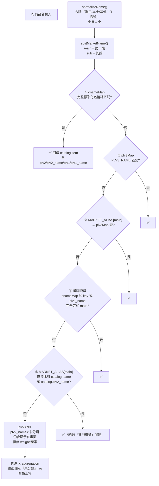
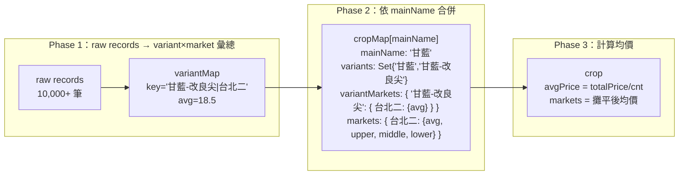
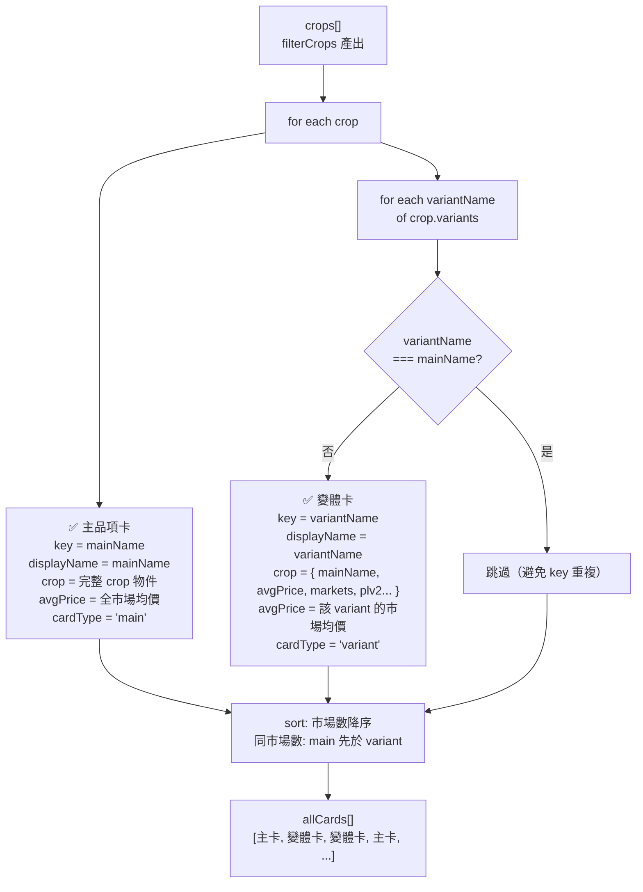
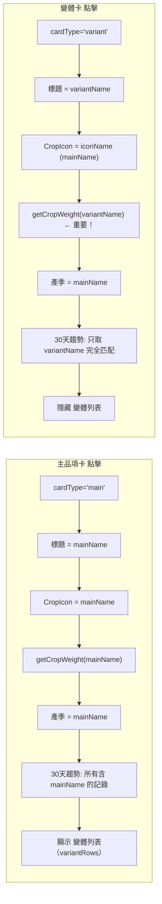
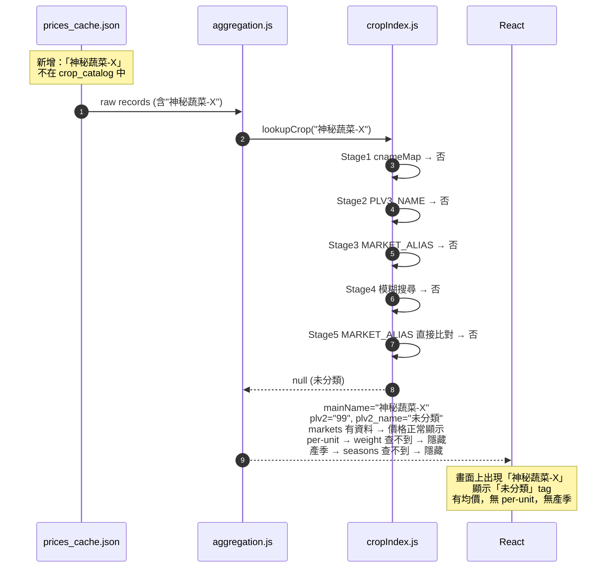
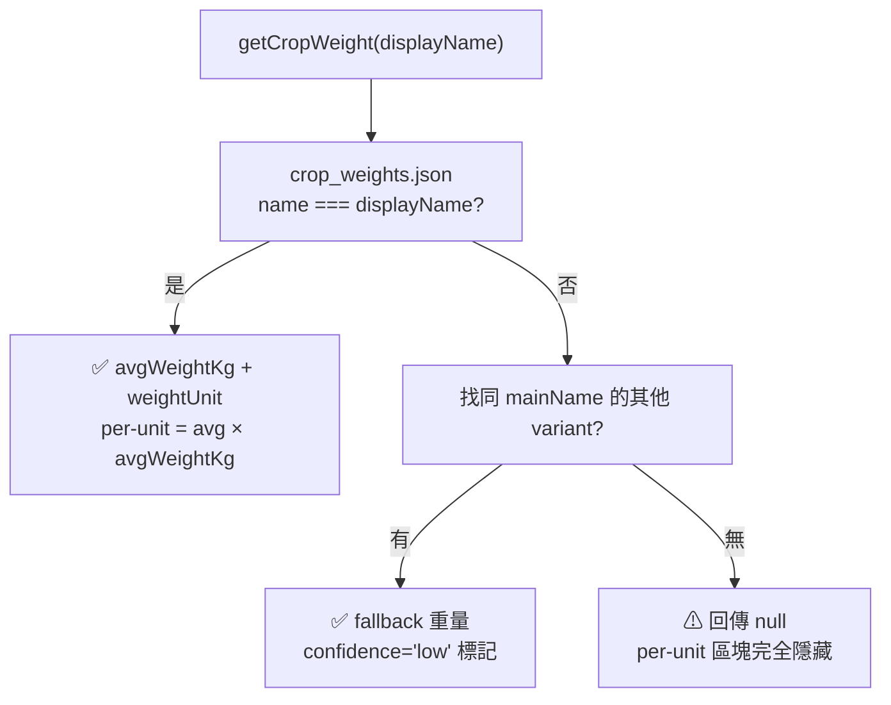

# Architecture Map

vage-app 整體依賴與資料流圖。每次任務結束必須更新本檔。

## 系統總覽

```mermaid
graph TD
  subgraph Sources[上游資料]
    A1[data.gov.tw<br/>政府資料開放平臺]
    A2[data.moa.gov.tw<br/>農產品交易行情 API<br/>FarmTransData]
    A3[data.moa.gov.tw<br/>農作物統一名稱 API<br/>LC7YWlenhLuP]
  end

  subgraph StaticData[靜態資料 public/data/]
    B1[crop_catalog.json<br/>918 variants<br/>官方作物目錄 PLV1~PLV6]
    B2[prices_cache.json<br/>每日快取 (daily_cache.cjs)<br/>行情 raw records]
    B3[market_alias.json<br/>市場別名對照<br/>北農拍賣名→Catalog名]
    B4[crop_weights.json<br/>單品重量估算<br/>869/918 variants (94.7%)]
    B5[crop_seasons.json<br/>產季月份<br/>LLM 估算]
  end

  subgraph LLM[LLM 估算管線 scripts/]
    L1[estimate_crop_weights.cjs<br/>split → run → merge]
    L2[batches/<br/>31 batch × 30 variants<br/>NVIDIA NIM]
  end

  subgraph FetchLayer[前端抓取層 src/services/api.js]
    F1[fetchPrices<br/>優先讀 prices_cache.json<br/>fallback: 即時抓 4 天]
    F2[loadCropCatalog<br/>讀 crop_catalog.json]
    F3[loadMarketAlias<br/>讀 market_alias.json]
    F4[loadCropWeights<br/>讀 crop_weights.json]
    F5[loadCropSeasons<br/>讀 crop_seasons.json]
  end

  subgraph MatchLayer[比對層 src/utils/]
    M1[buildCropIndex<br/>建立 cnameMap + plv3Map<br/>注入 marketAlias]
    M2[lookupCrop<br/>5級匹配:<br/>① CNAME 精確<br/>② PLV3_NAME<br/>③ MARKET_ALIAS→plv3<br/>④ 模糊搜尋<br/>⑤ MARKET_ALIAS→直接比對 catalog]
  end

  subgraph AggregateLayer[聚合層 src/utils/aggregation.js]
    AG1[aggregatePrices<br/>Phase1: (variant, market) 彙總<br/>Phase2: mainName 合併<br/>Phase3: 市場均價攤平]
    AG2[filterCrops<br/>category + query + favorites<br/>輸出 crops[]]
  end

  subgraph CardLayer[卡片產生 src/App.jsx]
    C1[allCards useMemo]
    C2["split main + variant 兩種卡<br/>main 卡: avgPrice=全市場均價<br/>variant 卡: avgPrice=該variant 均價<br/>sort: 市場數降序<br/>同市場數: main 先於 variant"]
  end

  subgraph UI[React 前端]
    U1[ProductCard<br/>displayName 顯示<br/>CropIcon 用 mainName<br/>per-unit: avg×weight]
    U2[DetailModal<br/>main: 顯示所有 variants<br/>variant: 隱藏 variant 列表<br/>CropIcon: iconName (mainName)<br/>getCropWeight: variant 名<br/>getSeason: mainName<br/>30天趨勢: variant 匹配]
    U3[CropIcon<br/>奶油底圓 + 中文首字<br/>name=mainName (variant卡也相同)]
  end

  A2 -->|每日快取| B2
  A3 -->|每週/手動| B1
  B1 --> M1
  B3 --> F3
  B4 --> F4
  B5 --> F5
  B2 --> F1
  F1 --> AG1
  F2 --> AG2
  F3 --> M1
  M1 --> M2
  AG1 --> M2
  M2 --> AG1
  AG2 --> C1
  C1 --> U1
  U1 --> U2
  C1 --> U2
```

---

## 分類 Lookup 流程（5級匹配）



**實作位置：** `src/utils/cropIndex.js` → `lookupCrop()`

---

## Aggregation 資料結構



**產出 crop 物件：**
```js
{
  mainName: "甘藍",
  plv2: "01",           // 葉菜類
  plv2_name: "葉菜類",
  plv1: "002",
  avgPrice: 18.5,        // 全市場加權均價
  markets: {
    "台北二": { avg: 18.2, upper: 22, middle: 18, lower: 14, cnt: 5 },
    "台中市": { avg: 19.1, ... },
    "高雄市": { avg: 18.0, ... }
  },
  variants: ["甘藍", "甘藍-改良尖", "甘藍-新品種"],
  variantMarkets: {
    "甘藍-改良尖": { "台北二": { avg: 20.5 }, "台中市": { avg: 21.2 } },
    "甘藍": { "台北二": { avg: 16.0 }, ... }
  }
}
```

---

## 主畫面卡片產生邏輯（allCards）



**實作位置：** `src/App.jsx` → `allCards useMemo`

---

## DetailModal：main 卡 vs variant 卡



**實作位置：** `src/components/DetailModal/DetailModal.jsx`

---

## 新行情資料進來時的相容性處理



**防呆機制：** 未分類品項仍顯示於畫面，per-unit/產季等輔助資訊低調處理（空白而非錯誤）。

---

## 重量查詢流程



**實作位置：** `src/utils/cropWeights.js` → `getCropWeight()`

---

## 資料檔案對照

| 檔案 | 用途 | 使用者 |
|------|------|--------|
| `crop_catalog.json` | 官方作物目錄（PLV1~PLV6）918 variants | `buildCropIndex()` |
| `prices_cache.json` | 每日行情 raw data | `aggregatePrices()` |
| `market_alias.json` | 北農→官方名稱對照 | `buildCropIndex(catalog, marketAlias)` |
| `crop_weights.json` | 單品重量估算（869/918 = 94.7%） | `getCropWeight()` |
| `crop_seasons.json` | 產季月份 | `getCropSeason()` |

---

## PLV1 分類保留策略

| PLV1 | 名稱 | 保留策略 |
|------|------|---------|
| 001 | 稻米類 | 🔪 已過濾 |
| 002 | 蔬菜類 | ✅ 保留 |
| 003 | 果樹類 | ✅ 保留（水果分類） |
| 004 | 花卉類 | 🔪 已過濾 |
| 005 | 雜糧類 | ✅ 保留 |
| 006 | 特用作物類 | 🔪 已過濾 |
| 007 | 農產品加工類 | 🔪 已過濾 |
| 010 | 其他作物類 | 🔪 已過濾 |

**最終保留：918 variants（蔬菜 531 + 果樹 332 + 雜糧 55）**

---

## 已實作 / 待實作

- [x] 作物名稱五級匹配 (cropIndex.js)
- [x] MARKET_ALIAS 外置 market_alias.json
- [x] 過濾花卉 (catalog + fetchPrices N06)
- [x] 過濾稻米 (catalog)
- [x] 修正 fruit 分類條件 (aggregation.js)
- [x] 30 天價格曲線 (DetailModal)
- [x] DetailModal 跨變體彙整 (mainName)
- [x] fetchPrices timeout + retry
- [x] 後端每日快取 (scripts/daily_cache.cjs)
- [x] NVIDIA NIM 重量預估管線（split/run/merge, variant 為單位）
- [x] 主畫面展開 main + variant 兩種卡片
- [x] DetailModal variant 專屬顯示邏輯
- [x] CropIcon 統一圖片佔位（variant 卡也用 mainName）
- [x] 各作物手繪插圖（主人提供）
- [ ] 右側蔬菜籃插圖（主人提供）
- [ ] 新品項進來時 alert/log 追蹤（catalog 缺漏 report）
- [x] crop_seasons 覆蓋率 98%（303/309 mainNames，僅 6 個罕見品項缺口）

---

## 關鍵檔案索引

- [src/utils/cropIndex.js](../src/utils/cropIndex.js) — 5級分類匹配
- [src/utils/aggregation.js](../src/utils/aggregation.js) — 行情彙總
- [src/utils/cropWeights.js](../src/utils/cropWeights.js) — 重量查詢
- [src/App.jsx](../src/App.jsx) — 卡片產生邏輯
- [src/components/DetailModal/DetailModal.jsx](../src/components/DetailModal/DetailModal.jsx) — variant/main 雙模式
- [src/components/ProductCard/ProductCard.jsx](../src/components/ProductCard/ProductCard.jsx) — 卡片元件
- [scripts/estimate_crop_weights.cjs](../scripts/estimate_crop_weights.cjs) — LLM 重量估算管線
- [public/data/market_alias.json](../public/data/market_alias.json) — 市場別名靜態資料
