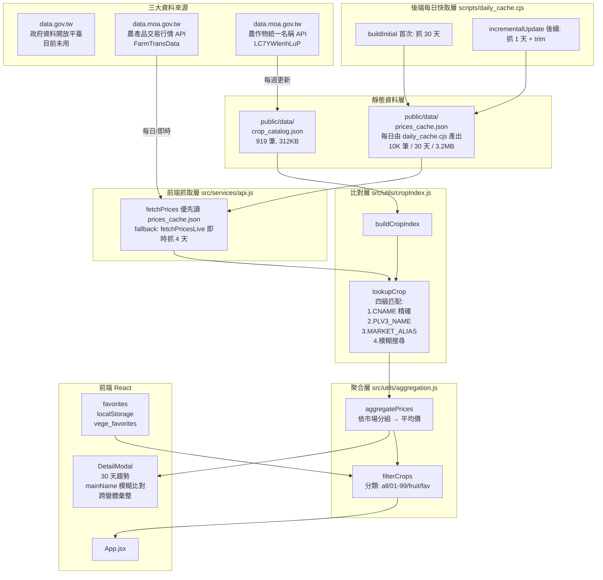

# Architecture Map

vage-app 整體依賴與資料流圖。每次任務結束必須更新本檔。

## 系統總覽

## PLV1 分類保留策略

| PLV1 代碼 | 名稱 | 筆數 | 狀態 |
|-----------|------|------|------|
| 001 | 稻米類 | 0 | 🔪 已過濾 (catalog + fetch) |
| 002 | 蔬菜類 | 531 | ✅ 保留 |
| 003 | 果樹類 | 332 | ✅ 保留 (水果分類) |
| 004 | 花卉類 | 0 | 🔪 已過濾 (catalog + fetch N06) |
| 005 | 雜糧類 | 56 | ✅ 保留 (玉米/落花生) |
| 006 | 特用作物類 | 0 | 🔪 已過濾 (茶/咖啡/油料) |
| 007 | 農產品加工類 | 0 | 🔪 已過濾 (加工品) |
| 010 | 其他作物類 | 0 | 🔪 已過濾 (雜項) |

**最終保留：919 筆（蔬菜 531 + 果樹 332 + 雜糧 56）**

## 已實作 / 待實作

- [x] 作物名稱四級匹配 (cropIndex.js)
- [x] MARKET_ALIAS 別名表 (北農 → 官方)
- [x] 過濾花卉 (catalog + fetchPrices N06)
- [x] 過濾稻米 (catalog)
- [x] 修正 fruit 分類條件 (aggregation.js: plv1 === '003')
- [x] 30 天價格曲線 (fetchPrices + DetailModal slice(-30))
- [x] DetailModal 跨變體彙整 (mainName)
- [x] fetchPrices timeout + retry
- [x] MARKET_ORDER 統一單一真源
- [x] 後端每日快取 (scripts/daily_cache.cjs + prices_cache.json)
- [x] localStorage 鍵統一為 vege_favorites
- [ ] 後端每日快取 (api.md §4)
- [ ] MARKET_ALIAS 持續補充
- [ ] 30 天價格曲線 (DetailModal)
- [ ] 其他類別裁決 (006/007/010)

## 關鍵檔案索引

- [src/services/api.js](../src/services/api.js) — fetchPrices + loadCropCatalog
- [src/utils/cropIndex.js](../src/utils/cropIndex.js) — 比對核心
- [src/utils/aggregation.js](../src/utils/aggregation.js) — 聚合與過濾
- [scripts/update_catalog.cjs](../scripts/update_catalog.cjs) — Catalog 重抓
- [scripts/test_match.cjs](../scripts/test_match.cjs) — 比對驗證
- [public/data/crop_catalog.json](../public/data/crop_catalog.json) — 靜態目錄
- [main.md](../main.md) — 高階架構圖 (舊版)
- [api.md](../api.md) — API 規格
